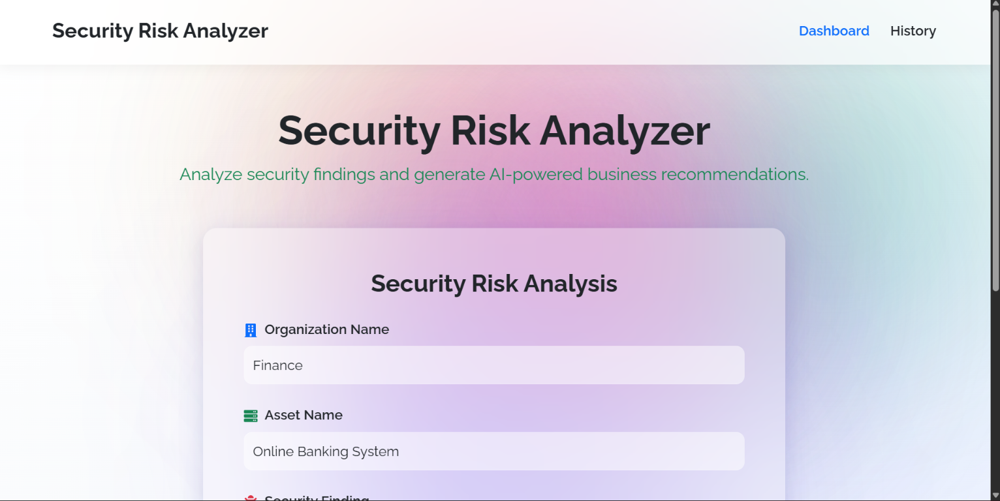
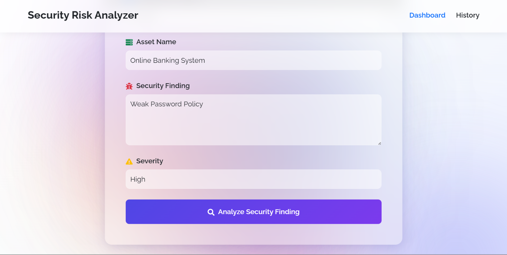
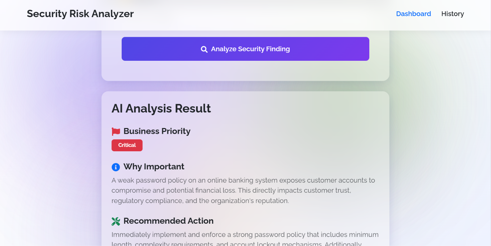
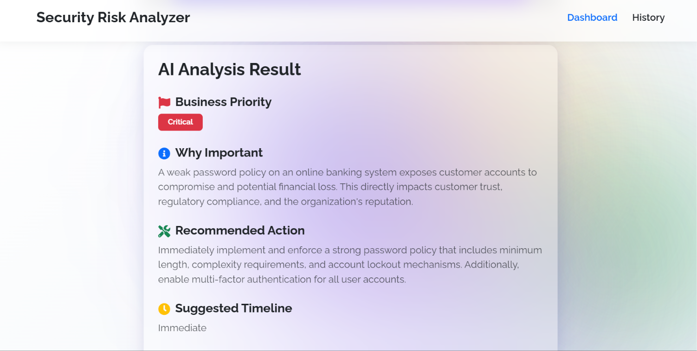
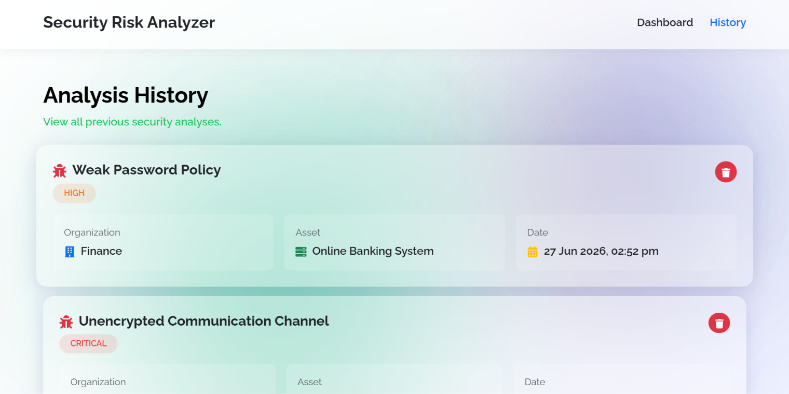
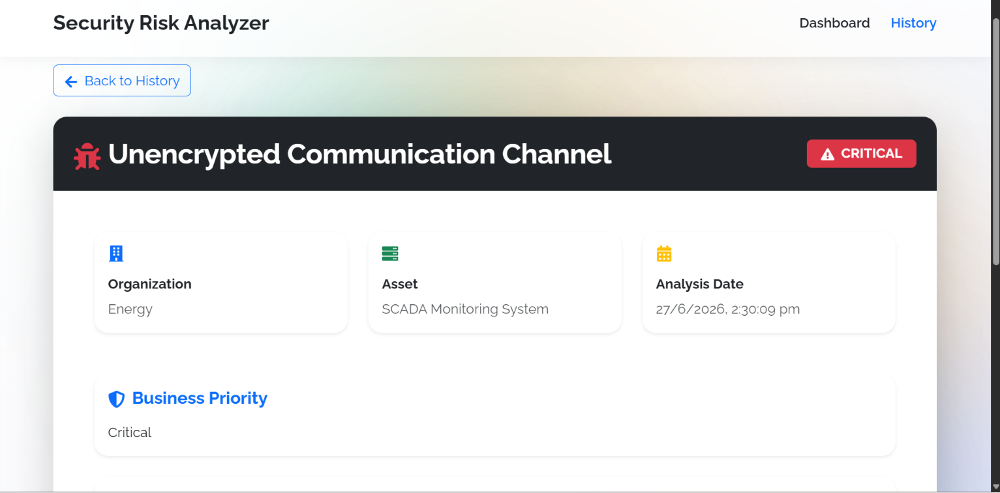
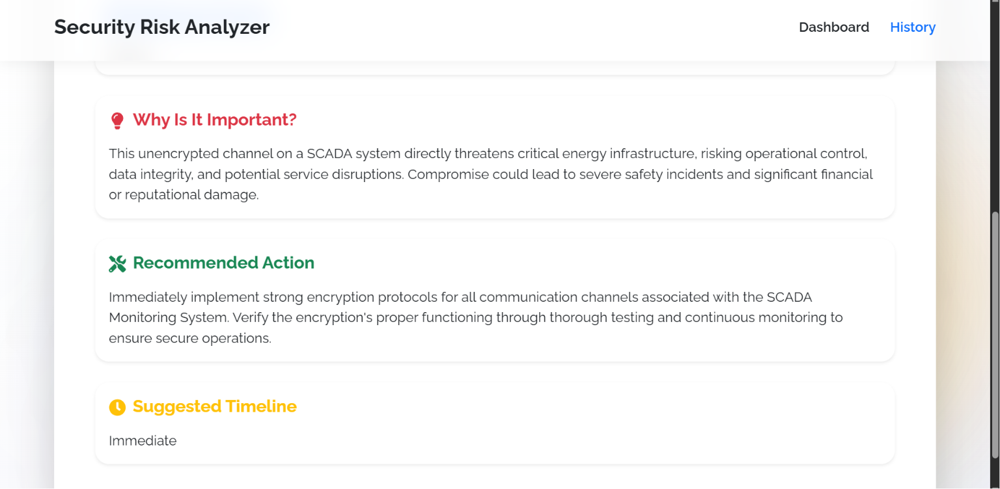

# AnantNetra Security Analyzer

An AI-powered Security Risk Analysis platform that transforms technical security findings into business-friendly recommendations. The system analyzes vulnerabilities, determines business priority, explains impact, recommends actions, and provides remediation timelines.

---

## Live Demo

### Frontend
https://anantnetra-securityanalyzer.vercel.app

### Backend API
https://anantnetra-securityanalyzer.onrender.com

---

## Features

- AI-Powered Security Analysis
- Business Priority Assessment
- Risk Impact Explanation
- Recommended Remediation Actions
- Suggested Resolution Timeline
- Analysis History Management
- Delete Analysis Records
- Responsive Modern UI
- PostgreSQL Database Integration
- REST API Architecture

---

## Tech Stack

### Frontend
- React.js
- React Router
- Bootstrap 5
- Axios
- React Icons

### Backend
- Spring Boot 4.1.0
- Spring Data JPA
- PostgreSQL
- Gemini AI API
- Maven

### Deployment
- Vercel
- Render
- Neon PostgreSQL

---

## Application Workflow

1. User enters:
   - Organization Name
   - Asset Name
   - Security Finding
   - Severity

2. Frontend sends request to backend.

3. Backend validates request.

4. Gemini AI analyzes the security finding.

5. AI generates:
   - Business Priority
   - Why Important
   - Recommended Action
   - Suggested Timeline

6. Analysis is saved to PostgreSQL.

7. User can view analysis history.

---

# Screenshots

## 1. GitHub Repository Structure



---

## 2. Security Risk Analyzer Dashboard



---

## 3. Security Finding Input Form



---

## 4. AI Analysis Result



---

## 5. Detailed Recommendation Output



---

## 6. Analysis History Page



---

## 7. Detailed Analysis View



---

## API Endpoints

### Analyze Security Finding

```http
POST /api/v1/analyze
```

#### Request

```json
{
  "organization": "Finance",
  "asset": "Online Banking System",
  "finding": "Weak Password Policy",
  "severity": "High"
}
```

#### Response

```json
{
  "businessPriority": "CRITICAL",
  "whyImportant": "Weak password policies can lead to unauthorized access and financial loss.",
  "recommendedAction": "Implement strong password requirements and MFA.",
  "suggestedTimeline": "Immediate"
}
```

---

### Get Analysis History

```http
GET /api/v1/analyze/history
```

---

### Get Analysis By Id

```http
GET /api/v1/analyze/{id}
```

---

### Delete Analysis

```http
DELETE /api/v1/analyze/{id}
```

---

## Project Structure

```text
Anantnetra-securityanalyzer/
│
├── Frontend/
│
├── Backend/
│
├── Screenshot/
│   ├── SC1.png
│   ├── SC2.png
│   ├── SC3.png
│   ├── SC4.png
│   ├── SC5.png
│   ├── SC6.png
│   └── SC7.png
│
├── README.md
│
└── .env.example
```

---

## Environment Variables

### Backend

```env
GEMINI_API_KEY=your_gemini_api_key

SPRING_DATASOURCE_URL=your_database_url

SPRING_DATASOURCE_USERNAME=your_username

SPRING_DATASOURCE_PASSWORD=your_password
```

### Frontend

```env
VITE_API_BASE_URL=https://your-backend-url/api/v1
```

---

## Local Setup

### Clone Repository

```bash
git clone https://github.com/atharv0825/Anantnetra-securityanalyzer.git
```

### Backend

```bash
cd Backend

mvn clean install

mvn spring-boot:run
```

Backend runs on:

```text
http://localhost:8080
```

### Frontend

```bash
cd Frontend

npm install

npm run dev
```

Frontend runs on:

```text
http://localhost:5173
```

---

## Assignment Requirements Covered

- Frontend Dashboard
- Backend REST API
- AI Integration (Gemini)
- Database Storage
- Analysis History
- Deployment
- Documentation
- Input Validation
- Error Handling
- Delete History

---

## Future Enhancements

- Authentication & Authorization
- Search & Filter History
- Export Reports
- PDF Generation
- Dashboard Analytics
- Role-Based Access Control

---

## Author

### Atharv Babar

Computer Science Engineer

GitHub:
https://github.com/atharv0825

---

## Assignment Submission

### GitHub Repository
https://github.com/atharv0825/Anantnetra-securityanalyzer

### Live Application
https://anantnetra-securityanalyzer.vercel.app

Built as part of the Backend Engineer Intern Technical Assignment for AnantNetra Technologies.
